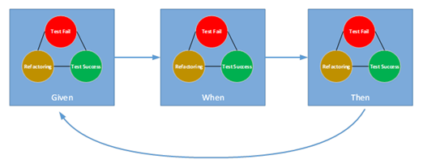

### Microservice Behavior Driven Development (BDD) Sample Code 
This code repository consists of two parts - C# code and Python code. Both serve the same purpose which is to demostrate how to perform Behavior Driven Development (BDD) in SDLC. The viewers can clone both of them to their local drive and run the demo without extra installation except some prerequisites as described in its associated [Microservice BDD tutorial](https://medium.com/@robertwang_60970/creating-a-microservice-with-bdd-in-c-af66bd608da6).

##### [csharp_demo](https://github.com/EnterpriseWS/microservice_bdd_demos/tree/master/csharp_demo) Folder
**Operating System:** Windows 7 and above
**Developer IDE:** Microsoft Visual Studio 2017
**.Net Framework:** 4.5 and above

##### [python_demo](https://github.com/EnterpriseWS/microservice_bdd_demos/tree/master/python_demo) Folder
(TBD)